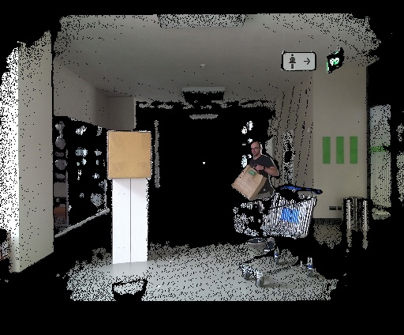
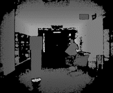
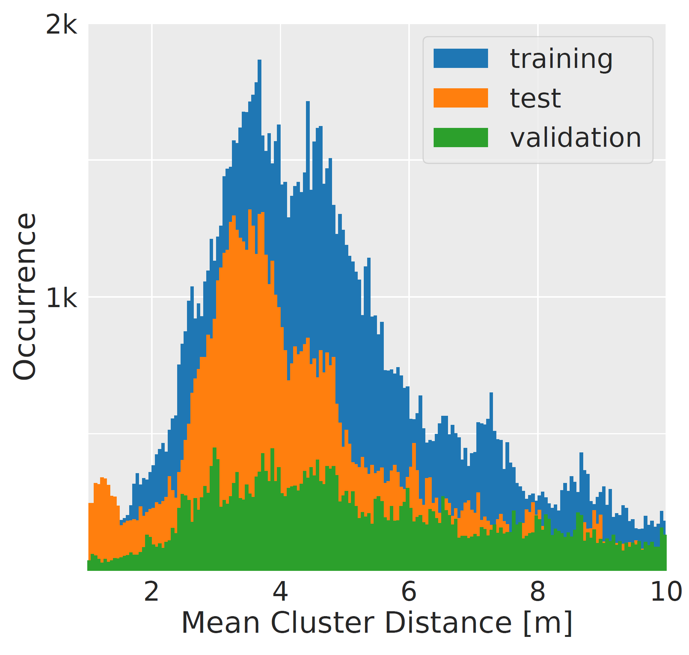

# NICR Multi-Task Dataset
The [NICR Multi-Task Dataset](https://www.tu-ilmenau.de/neurob/data-sets-code/depth-multi-task/)
is a dataset for patch-based person classification (person vs. non-person objects) and posture classification (standing vs. sitting vs. squatting).
The data was recorded using a Kinect2 sensor and consists of labeled depth image patches of 27 persons in various postures and of various non-person objects.
In total, the dataset consists of more than 235,000 samples divided into non-overlapping subsets for training, validation, and test.

We used the NICR Multi-Task Dataset together with our [NICR RGB-D Orientation Dataset](https://www.tu-ilmenau.de/neurob/data-sets-code/rgb-d-orientation/) to train a multi-task person perception system that performs person detection, upperbody orientation estimation, and body posture classification using a single and leightweight deep neural network.

## Recording Setup and Recorded Data
We recorded person data in various sessions using static scenes with only one person in one posture present at a time. 
Using a depth-based background subtraction and a generator for regions of interest ([Jafari, 2014, RWTH Aachen](https://ieeexplore.ieee.org/abstract/document/6907688)), a person point cloud could be automatically extracted without manual labeling for each scene of a session.
These point clouds were then used to extract a person patch from each depth image.
We changed the scene up to five times per person and posture to introduce different occlusion patterns in the recordings. 
Furthermore, we recorded data continously while each person was moving in order to ensure a higher variance of views and distances to the sensor and to ensure a higher number of data samples.
In total, 27 persons were recorded in distances of about 2m to 10m to the sensor.
All ground truth labels were subsequently verified manually after the recording. 
Patches that could not be clearly assigned to one posture class, e.g. due to heavy occlusions, were labeled as _person without posture_.

Non-person data was recorded by driving our robot around in person-free areas of five different buildings.
We applied the same region of interest generator ([Jafari, 2014, RWTH Aachen](https://ieeexplore.ieee.org/abstract/document/6907688)) in order to extract non-person patches from the depth images.
Finally, we manually checked the recorded data to ensure that every non-person image is truly free of persons.


 &nbsp;&nbsp;&nbsp;&nbsp;&nbsp;&nbsp;   
Example scene (color and depth image) of one sample in the dataset, illustrating the recording scenario and the artificial occlusions.  
The resulting person sample that is part of the NICR Multi-Task Dataset is shown on the right.

In addition to the depth image patches, the dataset includes a json file for each sample that contains among other things, the posture class (for person samples), the mean distance to the sensor, and encasing bounding boxes. In order to be able to convert the images to point clouds, the json files also contain the intrinsic parameters of the Kinect2 sensors.

## Data distribution
In total, the [NICR Multi-Task Dataset](https://www.tu-ilmenau.de/neurob/data-sets-code/depth-multi-task/)
contains 73,506 person samples of 27 persons from which 20 are male and 7 are female, and 163,798 background/non-person data samples from five different environments, four from our university and one from a local supermarket. 
The dataset is split into training, validation, and test subsets as follows: 

| dataset | male persons | female persons | person samples | negative samples |
|:--------:|:------------:|:--------------:|:--------------:|:----------------:|
| training | 10 | 4 | 39989 | 86,781 |
| validation | 3 | 2 | 17,303 | 17,594 |
| test | 7 | 1 | 16,214 | 59,423 |

As we did not want to have the same person in different subsets, we split the data by person and not by the number of samples.

The image below shows the distance distribution of our recorded image patches. The mean cluster distance was calculated by averaging all depth values of a depth patch.  



## File Structure
There is a directory for each subset of the dataset, i.e. a directory for training (train), validation (valid) and test. 
Each subset directory contains subdirectories for the respective body posture classes (i.e. person-standing, person-sitting, person-squatting) as well as non-person samples.
Each of the directories further has the following structure:
- *json*: Contains json files with the label information for each sample, including among other things the ground truth (posture) class, average distance to the sensor, encasing bounding box, and the camera parameters (extrinsic and intrinsic)
- *instances*: Contains the depth patches 

These directories further contain subdirectories for each recording session that hold the actual data.
```text
├── LICENSE
├── test
│   ├── non-person-building-2-new-driver
│   │   ├── instances
│   │   └── json
│   ├── non-person-building-2-old-driver
│   │   ├── instances
│   │   └── json
│   ├── non-person-supermarket
│   │   ├── instances
│   │   └── json
│   ├── person-sitting
│   │   ├── instances
│   │   └── json
│   ├── person-squatting-1
│   │   ├── instances
│   │   └── json
│   ├── person-squatting-2
│   │   ├── instances
│   │   └── json
│   └── person-standing
│       ├── instances
│       └── json
├── train
│   ├── non-person-building-1-new-driver
│   │   ├── instances
│   │   └── json
│   ├── non-person-building-1-old-driver
│   │   ├── instances
│   │   └── json
│   ├── non-person-building-4
│   │   ├── instances
│   │   └── json
│   ├── non-person-robots-and-jackets
│   │   ├── instances
│   │   └── json
│   ├── person-sitting
│   │   ├── instances
│   │   └── json
│   ├── person-squatting-1
│   │   ├── instances
│   │   └── json
│   ├── person-squatting-2
│   │   ├── instances
│   │   └── json
│   └── person-standing
│       ├── instances
│       └── json
└── valid
    ├── non-person-building-3-new-driver
    │   ├── instances
    │   └── json
    ├── non-person-building-3-old-driver
    │   ├── instances
    │   └── json
    ├── person-sitting
    │   ├── instances
    │   └── json
    ├── person-squatting-1
    │   ├── instances
    │   └── json
    ├── person-squatting-2
    │   ├── instances
    │   └── json
    └── person-standing
        ├── instances
        └── json

```


## Get access to the NICR Multi-Task Dataset
The NICR Multi-Task Dataset is available for academic use only. 
A permanent staff member of your institution must fill out the [NICR Multi-Task Dataset Request](https://www.tu-ilmenau.de/fileadmin/media/neurob/datasets/NICR-Depth-Multi-Task-Dataset-Request.pdf) and sign the Terms and Conditions. Afterwards, send the request via E-Mail to daniel.seichter@tu-ilmenau.de. 
After checking your request, a download link and a password will be sent back to you.
If you are a student, you may have to ask your supervisor to sign.

## Source Code License and Citations
The source code in this package is published under BSD 3-Clause license, see [license file](LICENSE) for details. 
NOTE: This license only covers the source code in this package, NOT the actual dataset! 
Extra Terms and Conditions apply to the dataset, which must be aggreed to! 
See [Get access section](#get-access-to-the-nicr-multi-task-dataset) and the [NICR Multi-Task Dataset](https://www.tu-ilmenau.de/neurob/data-sets-code/depth-multi-task/) web page.

If you use our dataset in your work, please cite the following paper:
>Seichter, D., Lewandowski, B., Höchemer D., Wengefeld T., Gross, H.-M.
*Multi-Task Deep Learning for Depth-based Person Perception in Mobile Robotics*
in: IEEE/RSJ Int. Conf. on Intelligent Robots and Systems (IROS), Las Vegas, pp. 10497-10504, IEEE 2020

```bibtex
@InProceedings{Seichter-IROS-2020,
  author    = {Seichter, Daniel and Lewandowski, Benjamin and Höchemer, Dominik and Wengefeld, Tim and Gross, Horst-Michael},
  title     = {Multi-Task Deep Learning for Depth-based Person Perception in Mobile Robotics},
  booktitle = {IEEE/RSJ Int. Conf. on Intelligent Robots and Systems (IROS), Las Vegas},
  year      = {2020},
  pages     = {10497--10504},
  publisher = {IEEE}
}
```

## Usage

1. Download and extract dataset files
2. Install dependencies and python package (Python >= 3.6)
    ```bash
    # clone repository
    git clone https://github.com/TUI-NICR/nicr-multi-task-dataset.git
    
    # option 1: install OpenCV 3 separately (optional) and dataset package 
    pip install opencv-python==3.4.2.* [--user]
    pip install /path/to/this/repository [--user]

    # option 2: install dataset package including OpenCV 3
    pip install /path/to/this/repository[with_opencv] [--user]
    ```
3. Use dataset (examples)
    ```python
    from nicr_multi_task_dataset import load_set
    import matplotlib.pyplot as plt
 
    # load set, e.g. training set
    dataset = load_set('/path/to/downloaded/dataset', set_name='train')
 
    # load depth patch of a single sample, e.g., the 120,001th sample
    sample = dataset[120000]
    depth_patch = sample.get_depth_patch()
   
    # visualize sample
    fig = plt.figure()
    ax = fig.add_subplot(1, 1, 1)
    ax.imshow(depth_patch, cmap='gray')
    ax.axis('off')
    fig.suptitle(f'Class: {sample.posture_name}')
    fig.show()
    ```
    For further examples, see [Multi-Task Person Perception Repository](https://github.com/TUI-NICR/multi-task-person-perception).
